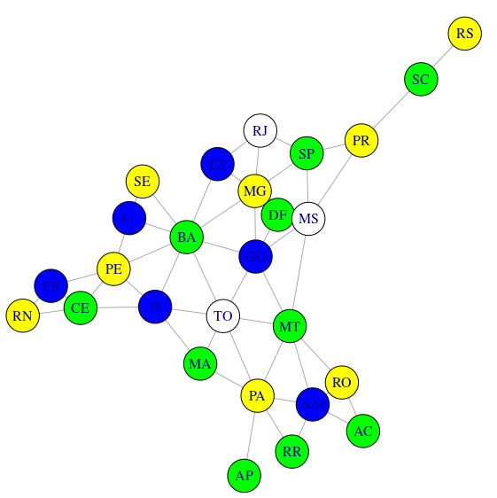

# Inteligência Artificial

Códigos dos laboratórios realizados durante o semestre para a disciplina.

Engloba as linguagens ***`Python`***, ***`R`*** e ***`Prolog`***.

## Laboratórios

[Lab01 - Aprendizado supervisionado](lab1/IA_ativ1.ipynb)

[Lab02 - A*](lab2/Atividade2.pdf)

[Lab03 - Coloração mapa do Brasil](lab3/Coloracao.R)

[Lab04 - Lógica de predicados](lab4/ex2.pl)