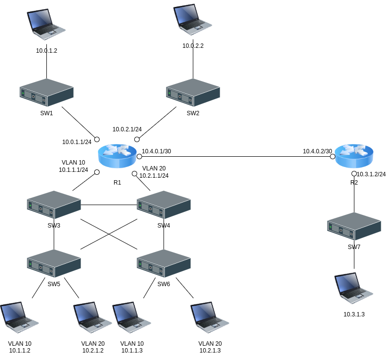

# Redes de Computadores B

Arquivos dos laboratórios realizados durante o semestre para a disciplina.

Engloba o software `Cisco Packet Tracer`.

## Laboratórios

[Aula01 - Infraestrutura de rede](Aula1)

[Aula02 - Infraestrutura e roteamento](Aula2)

[Aula03 - Spanning Tree](Aula3)

[Aula04 - VLAN](Aula4)

[Atividade - port-channel](atividade%20port-channel/)

[Atividade - HSRP](atividade%20HSRP/)

[Projeto 1 - VLANs](Projeto1)

